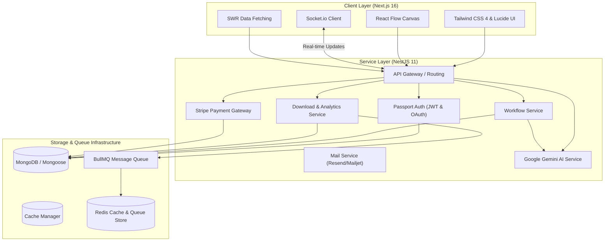

# ⚡ n8n Automation Marketplace & Dashboard

A professional, full-stack monorepo marketplace designed for discovering, sharing, visualising, and monetising **n8n automation workflows**. This repository brings together a high-fidelity **Next.js 16** frontend and an enterprise-ready **NestJS 11** microservices-inspired backend.

---

## 🏗️ High-Level System Architecture

The ecosystem leverages a decoupled architecture that provides secure authentication, high-performance workflow processing, visual canvas rendering, and AI-assisted workflow analysis.



---

## 🗂️ Workspace & Project Directory Structure

The workspace is organized into two primary applications alongside a Docker compose infrastructure for orchestration:

```text
n8n-dashboard/
├── n8n-marketplace/             # Next.js 16 Frontend App
│   ├── src/
│   │   ├── app/                 # Next.js App Router (auth, admin, plans, workflow, upload)
│   │   ├── components/          # Reusable dashboard UI elements
│   │   ├── context/             # Global contexts (Auth, Theme)
│   │   ├── hooks/               # Custom React Hooks
│   │   └── lib/                 # Core utilities, API clients (Axios, SWR)
│   ├── public/                  # Static assets & icons
│   ├── scripts/                 # Workflow importer & data preparation scripts
│   └── Dockerfile               # Multi-stage production build config
│
├── n8n-marketplace-backend/     # NestJS 11 Backend API
│   ├── src/
│   │   ├── auth/                # Local, JWT, & OAuth2 (Google/GitHub) authentication
│   │   ├── workflows/           # n8n Workflow management & public view engine
│   │   ├── downloads/           # Analytics, download trackers & free-tier rate limits
│   │   ├── analytics/           # Marketplace usage dashboards
│   │   ├── subscriptions/       # Tier plans & user subscription models
│   │   ├── payments/            # Stripe integration endpoints & webhooks
│   │   ├── mail/                # Resend & Mailjet integration templates
│   │   └── config/              # Centralised type-safe configurations
│   ├── test/                    # Unit, Integration & E2E Jest tests
│   └── Dockerfile               # Custom production build config
│
└── docker-compose.yml           # Redis standalone setup & Backend orchestration
```

---

## 🚀 Key Features

### 💻 n8n-marketplace (Frontend)
- **Interactive Workflow Canvas**: Powered by `reactflow` to render interactive JSON-based n8n workflows directly in the browser.
- **Fuzzy Search**: Implemented client-side with `fuse.js` to enable lightning-fast queries across names, nodes, and categories.
- **Dynamic Dashboards**: Admin, Creator, and Customer portals built using modern CSS, HSL colors, Tailwind 4, and Lucide React.
- **State Management**: Client state syncing with `SWR` and real-time alerts via `socket.io-client`.

### ⚙️ n8n-marketplace-backend (Backend)
- **Flexible Authentication**: Multiple strategy pipelines using Passport.js, covering local credentials, JWT validation with auto-refresh cycles, and Google/GitHub Social sign-in.
- **Public & Premium Access Control**: Granular endpoint guards that support unauthenticated reading for public workflows while protecting premium-tier assets.
- **Asynchronous Task Queueing**: Powered by `BullMQ` + `Redis` to manage heavy operations, background mailing, and metrics tracking without blocking API responses.
- **AI-Powered Synthesizer**: Integrates `@google/genai` (Gemini) to automatically synthesize tags, build descriptions, and validate structure for uploaded workflow files.
- **Stripe Subscriptions**: Fully ready webhook integration and payment session templates for SaaS tier checks.
- **Auto-generated Documentation**: Real-time Swagger OpenAPI docs available locally.

---

## 🛠️ Technology Stack

| Component | Technology | Primary Libraries / Frameworks |
| :--- | :--- | :--- |
| **Frontend** | React 19, Next.js 16 | Tailwind CSS 4, React Flow, SWR, Socket.io-client, Axios, Fuse.js, Lucide React |
| **Backend** | Node.js 22, NestJS 11 | Mongoose (MongoDB), BullMQ, Cache Manager, Passport (JWT/OAuth), Socket.io, Swagger |
| **Database** | MongoDB | Local instance / Cloud MongoDB Atlas |
| **Queuing/Cache** | Redis 7 | Standalone alpine image for BullMQ jobs and express-session state caching |
| **Integrations** | External APIs | Stripe SDK, Google Gemini AI SDK (`@google/genai`), Resend SDK, Mailjet |

---

## ⚙️ Environment Variables Setup

Before running the applications, configure the environment variables for both the frontend and backend.

### 1. Backend Configuration
Create a `.env` file in the `n8n-marketplace-backend` folder matching the `.env.example` structure:

```env
NODE_ENV=development
PORT=3001
API_PREFIX=api/v1

# Database & Cache Connection
MONGODB_URI=mongodb://localhost:27017/automation-marketplace
REDIS_HOST=localhost
REDIS_PORT=6379

# JWT Security
JWT_SECRET=your-super-secret-jwt-key-min-32-chars
JWT_EXPIRES_IN=15m
JWT_REFRESH_SECRET=your-refresh-secret-different-from-jwt
JWT_REFRESH_EXPIRES_IN=7d

# Google OAuth Credentials
GOOGLE_CLIENT_ID=your-google-client-id
GOOGLE_CLIENT_SECRET=your-google-client-secret
GOOGLE_CALLBACK_URL=http://localhost:3001/api/v1/auth/google/callback

# Stripe API Key Setup
STRIPE_SECRET_KEY=sk_test_placeholder
STRIPE_WEBHOOK_SECRET=whsec_placeholder
STRIPE_PUBLISHABLE_KEY=pk_test_placeholder

# Email Clients (Resend / Mailjet)
RESEND_API_KEY=re_placeholder
EMAIL_FROM=noreply@yourmarketplace.com

# Frontend Redirection Webhook URL
FRONTEND_URL=http://localhost:3000

# Rate Limiter
THROTTLE_TTL=60
THROTTLE_LIMIT=100

# Google Gemini API
GEMINI_API_KEY=your_gemini_api_key
```

### 2. Frontend Configuration
Create a `.env.local` file in the `n8n-marketplace` folder:

```env
NEXT_PUBLIC_API_URL=http://localhost:3001/api/v1
NEXT_PUBLIC_APP_URL=http://localhost:3000
NEXT_PUBLIC_ENABLE_EMAIL_LOGIN=false
```

---

## 🚦 Getting Started

### Option A: Manual Setup (Local Development)

#### 1. Spin up Databases
Ensure that a local MongoDB instance is running on port `27017` and a Redis instance on `6379`. Alternatively, you can start only the Redis container from the root directory:
```bash
docker compose up -d redis
```

#### 2. Run the Backend API
```bash
cd n8n-marketplace-backend
npm install
npm run start:dev
```
The API gateway will start on [http://localhost:3001](http://localhost:3001).

> [!NOTE]
> Once the backend is running, the Swagger interactive documentation can be viewed at [http://localhost:3001/api](http://localhost:3001/api).

#### 3. Run the Frontend App
```bash
cd n8n-marketplace
npm install
npm run dev
```
The Client UI will launch on [http://localhost:3000](http://localhost:3000).

---

### Option B: Docker Orchestration (Production/Staging Simulation)

We provide optimized `Dockerfile` instances for both projects and a root `docker-compose.yml` to orchestrate them together.

To start the infrastructure, run:
```bash
docker compose up --build -d
```

> [!IMPORTANT]
> The backend Docker service is configured to look for your host machine's MongoDB database using `host.docker.internal` on port `27017`. Ensure your host database is running and configured to accept connections from the container interface.

---

## 🧪 Testing and Tooling

### NestJS Backend Tests
Comprehensive Unit and End-to-End tests are defined in the backend project:
```bash
cd n8n-marketplace-backend

# Run Unit tests
npm run test

# Run End-to-End integration tests
npm run test:e2e
```

### Scripted Workflow Ingestion
You can run automated migration/ingestion scripts to quickly seed your marketplace database with boilerplate workflows:
```bash
cd n8n-marketplace
npm run import-workflows
```

